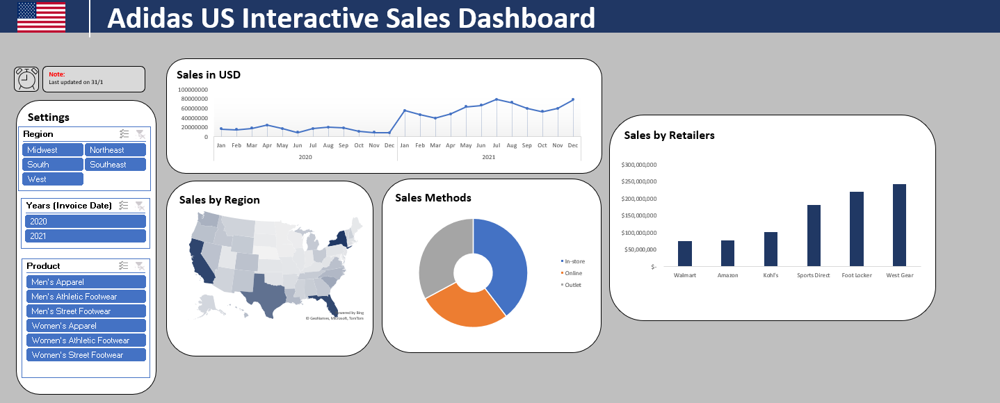

## Analyzing Adidas Sales using Excel

### Introduction:

I have analyzed Adidas sales for the term 2020-2021. All the analysis was done in Excel. Data cleaning was the first step before doing the analysis. Pivot tables were used. Filters are present to filter data based on region, year, and products. 

Analysis from the created dashboard:
Sales by retailer 
Sales by region 
Sales in USD 
Sales based on sales method 

 
 

### Glimpse of the dashboard:

  

